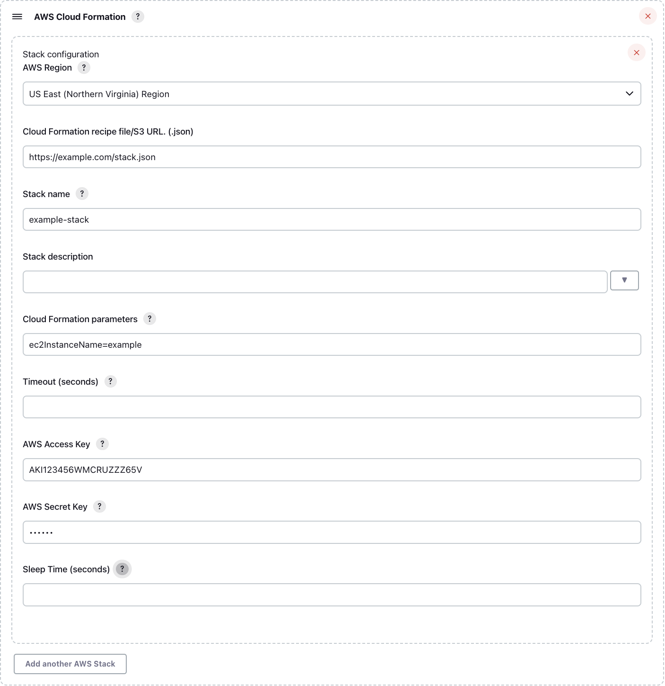

# Jenkins CloudFormation Plugin

This is a [Jenkins](https://jenkins-ci.org/) plugin for creating, using, and deleting
[AWS CloudFormation](http://aws.amazon.com/cloudformation/) stacks in your environment. 

Before using this plugin, please make sure you're familiar with understanding 
[pricing](http://aws.amazon.com/cloudformation/pricing/) for the AWS resources that you
create with AWS CloudFormation.

## Using the plugin
You can use this plugin:
 - as a wrapper (before and after the build)
 - as a build step
 - as a post-build step

In all three use cases, the configuration is identical.

### Stack Parameters
You can provide parameters as a comma- or semicolon-separated list of `key=value`. If you need to pass a list to one of
your variables you should use semicolons to separate parameters.

### Stack Outputs
If the stack that is created has
[outputs](http://docs.amazonwebservices.com/AWSCloudFormation/latest/UserGuide/using-cfn-return-values.html),
they will be added as variables to the build environment, so you can use
them during the build just as any other environment variable like
`$WORKSPACE`. The name of the variables will be the name of the output
item defined in the stack json document prefixed with the name of the
stack that produced it (ie. `example-stack_outputName`).

This has the useful side effect of allowing for the chaining of several
stacks where the ones further down can be fed the outputs of the
previous stacks as parameters. In this way, if you have a stack that
creates an instance and outputs its IP address you can potentially pass
the IP address into another stack as a parameter and use it in whatever
way you need.

## Contributing

To contribute to this project, please read the 
[Beginner's Guide to Contributing](https://wiki.jenkins-ci.org/display/JENKINS/Beginners+Guide+to+Contributing).
In particular, pay attention to "How about Java code?". Your submission should follow 
[Oracle Java Code Conventions](http://www.oracle.com/technetwork/java/codeconvtoc-136057.html).
I may reject pull requests that don't follow style conventions or don't have associated unit tests.

Thank you!
